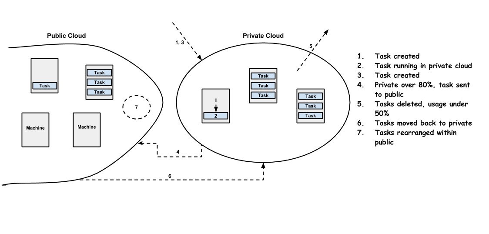
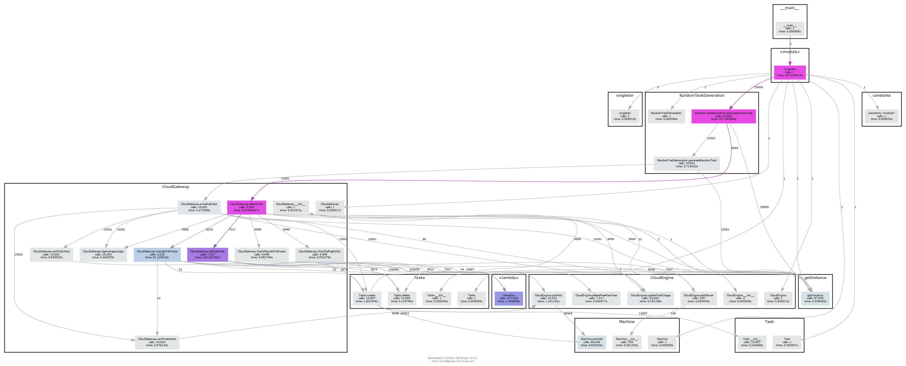
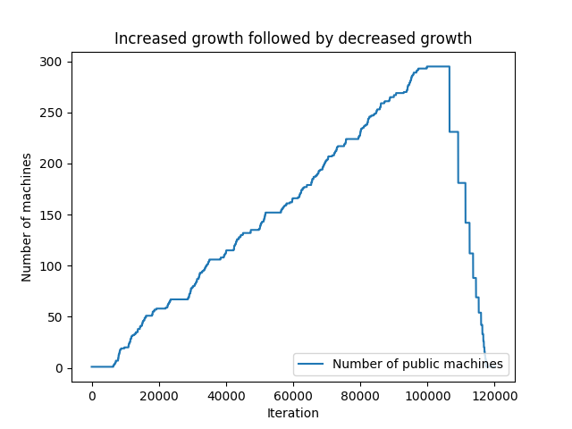
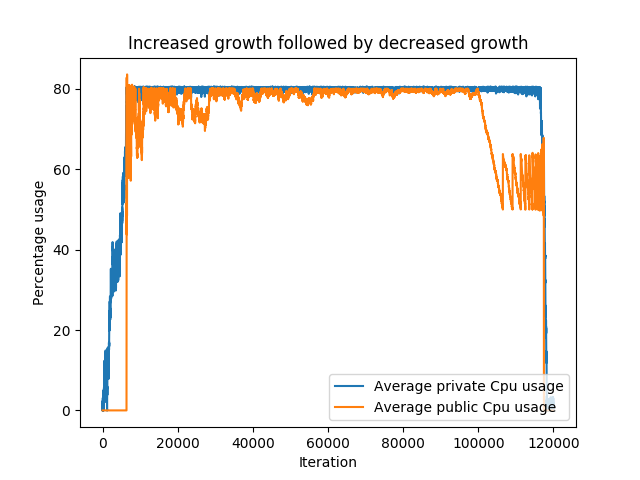
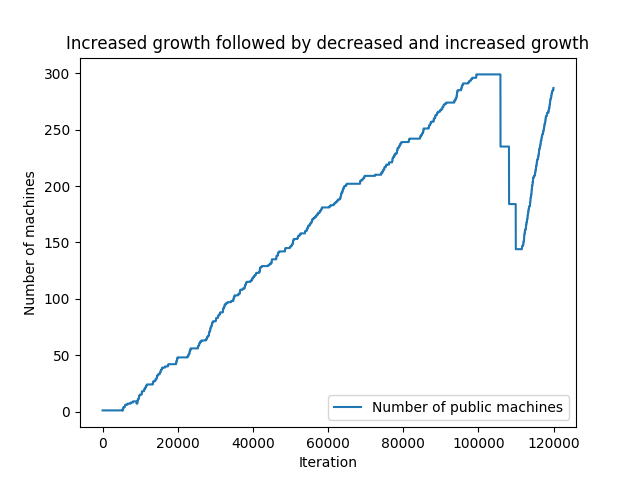
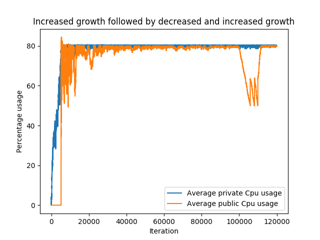

# Cloud Gateway
Aditya Gujral (726004085), Piyush Bhatt (227002733), Likhit Vivek Chirumamilla (325001774)

## Time spent
* We collectively worked for approximately 110 hrs for project 2.
* Approximately 30 collective hours were spent in planning, design and discussion about the project. This includes the time we spend for the initial project proposal.
* Approximately 60 collective hours were spend in coding and debugging.
* Around 20 collective hours were spent in analyzing the results and making the report.

## Project Specification
Our project focuses on implementing the seamless integration/transfer of tasks from a private cloud to a public cloud when the private cloud overloads over a specific limit. For this purpose, we are simulating a private cloud with a fixed number of homogeneous machines and created a script which generates tasks randomly to overload the private cloud. The usage of each of the machines as well as the average usage of the whole private cloud is being continuously monitored and as soon as the average usage goes over 80%, we are moving the tasks to one of the active machines in the public cloud. To reduce fragmentation, we are using Heaps to store the tasks and machines in an order, within the code, so that the tasks can be assigned/rearranged efficiently.

This kind of hybrid cloud service will be really useful in solving the problem of load balancing during peak times.

## Background Research
We looked at how AWS is using load-based instances to rapidly start or stop machines and how Amazon CloudWatch is being used to continuously monitor the workload metrics like average CPU usage and Memory consumption to upscale and downscale automatically in response to the varying input traffic. Our project is also implemented similarly, as we are balancing the load in our private cloud just like AWS, in its public cloud, the only difference being, we are additionally moving the tasks from private to public cloud.

We had to consider the issue of fragmentation and understand how to use Heaps to handle the proper assignment and rearrangement of tasks. 

We also understood how Azure implemented its horizontal and vertical auto-scaling but felt that the AWS model suits our project better and decided on similar design choices.

## Design (Choices)

The diagram above is a subtle description of what our project is designed to do. Initially, tasks are generated randomly by our script and are hosted in the private cloud. New tasks keep getting generated and after the private cloud reaches the 80% threshold, any new task that's generated will be sent to the public cloud. The script also deletes the tasks randomly. So, after a certain point of time, you can expect the usage of the private cloud to go below 50%. Then, to maintain the efficiency, we are moving some of the tasks from public cloud back to the private cloud. The next step is to consolidate the remaining tasks in the public cloud and stop any machines that aren't running any tasks.

Given below are some of our design choices and assumptions which will explain the project in more detail.

#### Full Ownership
We are assuming that we own both the private and the public cloud so that, we are responsible for taking care of all the load-balancing and defragmentation ourselves. If we use AWS, it'll do all the optimization automatically and that would limit the scope of our project. 

Although we are randomly generating the tasks, it's not completely random. We are using some constraints like growth rate, max size of a task with respect to machine capacity etc. So, it's only logical that we have a complete knowledge on the kind of workload we need to handle which is why we are using the cloud internally.

#### Homogeneous Cloud
One of the important choices we made is that, we are running a homogeneous datacenter i.e. We have all the software stack we need and all the machines are alike. That way it'll be easier to monitor the usage of each of the machines and prevent fragmentation when moving the tasks from one machine to the other, from private to public cloud or within the public cloud.

#### Unlimited resources in Public Cloud
To handle any kind of workload, we are assuming we have unlimited resources in our public cloud. So, theoretically, we can keep on adding the tasks and will never run out of machines. But at the same time, we don't want to be inefficient. So, we chose the AWS model, where the machines are started or stopped on demand, and we are assuming that only the active machines will consume power. To improve the efficiency further, we are ensuring that the usage of the public cloud doesn't fall below 50%, by rearranging the tasks when more of the machines are being sparsely used.

#### Max and Min load
Just like AWS, we are placing a threshold on the average usage of both private and public clouds to handle sudden spikes in the workload and also to increase efficiency. For example, if the private cloud avergae cpu usage crosses 80%, we are going to move some tasks to the public cloud, and if it goes under 50%, we are moving the tasks from the public cloud back to the private cloud. 

Additionally, if the usage in the public cloud goes under 50%, we are moving the tasks to only a few machines within the public, and stopping the machines which become empty, thus increasing efficiency. We are also keeping track of resources for each machine and ensure that each machine has at least 10% of free resources at any point of time. Hence the maximum cpu usage of any machine at any given time is 90%. We required the individual resource usage to be greater than 80% and also need to avoid usage of 100%, and hence we chose maximum 90% usgae for any resource.

#### Using Heaps for Defragmentation

We are moving the tasks from private to public, public to private and within public itself. So, just assigning the tasks randomly to any machine leads to fragmentation. To prevent that, we are maintaining three separate heaps to store tasks in the decreasing order of their requirements and machines in the increasing order of their free vcpus, one for the private cloud and one for the public cloud. So, using the Heaps, we always try to assign the biggest task to the machine with the least available vcpus, thus preventing the inefficient use of machines.

Consider a simple scenario where we have two machines with 4 vcpus each. Let's say two tasks which require 2 vcpus were created. If we randomly assign one task to each machine and a third task which needs 3 vcpus gets generated, we need to start a third machine to host the task. Instead if we add the second task to the first machine itself, using our Heap machanism, we don't need to start a third machine for hosting the third task. This is not a practical example, but you can clearly understand why we need this defragmentation mechanism.

You must have observed by now that we are using only vcpus to sort the machines. This, however, is sufficient for our project because we made some assumptions on the machines' capacity and the size of the tasks as explained below.

#### Machine specs vs Task requirements
We are using only one kind of machine, similar to [xE.16x.Large used by AWS](https://aws.amazon.com/ec2/instance-types/x1e/). It has 64 vcpus, 1952 GB RAM and 1920 GB of disk space. And we are creating the tasks in a constrained manner, where the average number of vcpus required for a task is 4, and a 32 GB of average RAM and disk space. Based on the number of vcpus, we can see that a machine is expected to host 16 tasks. 16 tasks consume expected 512 GB RAM and disk space for the tasks running on a single machine at any point of time. 512 << 1920 and 1952, hence we focus on optimal allocation based on vcpus only. We do have check for RAM and disk space, but the optimsations are based on cpu usage only.

#### Private trumps Public
We prefer to run the tasks in the private cloud rather than in the public cloud. This is a common assumption but it's an essential part of our design. For every new task that's created, our code always checks if it can be hosted in the private cloud before sending it to the public cloud. This is also the reason why tasks are sometimes moved back to the private cloud. For example, if some of the tasks that were running in the private cloud got deleted and the usage drops under 50%, we move some of the tasks from public cloud back into private cloud.

This mechanism ensures the efficient use of machines in both the public and private clouds.

## Implementation
**To see the visual representation of the architecture please visit below link (Too large to be included in this document)**
[Right click here](http://people.tamu.edu/~pbhatt/assets/images/pycallgraph.png) and open the below implementation diagram in a new tab for better viewing.

The above image shows the design and calling structure of the overall code. The design can be understood in terms of following modules:
* **Task Class:** The object of this class is equivalent to an "instance" in project P1. Each object of this class stores the attributes of that instance - name, vcpus, memory, disks, machine in which it is scheduled, and where is its parent machine located - in the public cloud or the private cloud. 
* **Tasks Class:** This is a singleton class which acts as a manager for the tasks running in the system (both private and public cloud). This class deals with the creation and deletion of the tasks in the system, while managing the free meemory, vcpus and disks.
* **Machine Class:** Each machine in the private and the public cloud has the same configuration. This functionality of this class is similar to that of Machine explained in project P1. Besides storing the information about name, vcpus, memory and disks, an object of this class also stores the available free memeory, disks and vcpus for scheduling new tasks. Moreover, whether a machine can host an incoming task or not can be checked by calling its `canHost()` function.
* **CloudEngine Class:** An object of this class represents a manager for a cloud. We are managing two objects of this class in our project, one for our Public Cloud and another for our Private Cloud. This manager class provides functionality to add machine (server) to the cloud, remove a machine from the cloud and check if there is any machine in the cloud that can host the new incoming task. 
* **CloudGateway:** This is a singleton class which manages the overall scheduling and deletion of the tasks while providing optimum utilization, manages the migrations between public and private cloud and attempts to keep the public and private cloud defragmented. All the migrations and the attempts of defragmentation are done with a level of abstraction, each tasks is assigned as if it is being done on a single machine.

## Instructions
* Use python 2.7
* Run `python cloudGateway.py`

## Results
 | 
-------------------------------------- | --------------------------------------

In the first case, till 100000 iterations, we are generating and deleting the tasks with 52% and 48% respectively. As expected, the public machines are not increasing initially as all the tasks are going into the private cloud. And when the private reaches the 80% usage, new machines are started in the public cloud, and their number keeps on increasing to accomodate the new tasks until 100000 iterations. Then we increase the rate of deletion of the tasks to 60% and the number of public machines starts decreasing.

CPU usage for the private cloud keeps increasing till it reaches 80% and then stays the same until all the tasks get deleted. This constant usage is because we are moving all the new tasks, when the private cloud is overloaded, to the public cloud. When we start deleting the tasks after 100000 iterations, we are moving the tasks from public back to private to maintain a constant usage of 80%. This is also the reason why you can see the fluctuations for the cpu usage in the public cloud at the end.

 | 
-------------------------------------- | --------------------------------------

Here, the number of tasks start to decrease after 100000, but again increase after 110000 and the graphs still show the expected behavior. It is intresting to observe that we are always efficiently using the private cloud by ensuring its usage close to 80%.

## Lessons Learned and Conclusion
* Gained knowledge on how AWS does the load-balancing in its public cloud
* Understood the reason for fragmentation and dealt with it successfully
* Understood more about P1 and the purpose of each of its commands
* Familiarized ourselves with Object Oriented Principles and Design Patterns in Python

We worked really hard on this project and tried to make it as robust as possible and we think it can be extended as a research project in the future as it has some practical applications. We are thankful to the instructors for letting us choose our own project and for the continous feedback and guidance.

## References
* [Load-based Scaling in AWS](https://docs.aws.amazon.com/opsworks/latest/userguide/workinginstances-autoscaling-loadbased.html)
* [Auto-scaling in Azure](https://docs.microsoft.com/en-us/azure/architecture/best-practices/auto-scaling)
* [PyCallGraph](http://pycallgraph.readthedocs.io/en/master/)
* Our P1 code
